##  Overview
**Jap! Rider Otw** is a 2D delivery simulation game developed for the course **CGD6224 Game Design Fundamentals** using GDevelop. 

### Story & Setting
You play as a university student struggling to make ends meet by working as a delivery rider. Set in a vibrant world inspired by Malaysian culture, the game includes neighborhood houses, local shops, and NPCs with authentic local character.

Your ultimate goal: earn enough money to survive and thrive while managing limited time, fuel, and unpredictable events.

###  Gameplay Objectives
- **Primary Objective**: Complete delivery orders to earn money and meet each level’s financial goal.
- **Levels**: Three progressive levels with increasing complexity:
  1. Pay monthly rent.
  2. Cover a family emergency.
  3. Save for tuition fees.

## 🕹️Core Mechanics
- **Timed Deliveries**: Deliver orders before deadlines — late deliveries reduce your earnings.
- **Fuel Management**: Monitor your petrol level and refuel when needed.
- **Random Events**: Interact with NPCs — some help, some hinder. Beware of robberies and accidents.
- **Performance Rating**: Your delivery time and accuracy affect your star rating and bonuses.

## 🎮Game Features
- **Interactive World**: Accept orders from houses, wait at shops, and deliver to NPCs.
- **Resource Management**: Balance money, fuel, and time under pressure.
- **Realistic Themes**: Reflect real-life stressors like financial burdens, time scarcity, and unexpected emergencies.
- **Multiple Outcomes**: Your efficiency and decisions impact whether you succeed or fail.

## 🧩How to Play

1. **Accept Order**  
   → Find houses with speech bubbles. Click the bubble to accept an order.

2. **Place Order at Shop**  
   → Go to the target shop and press a key/click to prepare the food.

3. **Pick Up**  
   → Return after preparation is complete. Tap to collect the food.

4. **Deliver**  
   → Return to the customer’s house (no bubble), collide, and tap to complete the order.

### Resource & Risk Management
- Keep track of your **timer**, **money**, and **fuel**.
- **Gas Stations** help you refuel. Running out = Game Over.
- Beware of **danger zones**: shortcuts may lead to robberies or accidents.

## 🌟Performance Rating System

- Deliver in **< 40%** of the time limit → **+½ star**
-  Late or incorrect delivery → **0 stars**
  - **3 stars** → Double the earnings  
  - **5 stars** → Triple the earnings

## 🏆 Win/Lose Conditions

- **Win**: Reach the money goal before time runs out.
- **Lose**:
  - Fail to meet the financial goal.
  - Suffer a major accident with insufficient funds for hospital bills.

## 📚 Tutorial Screenshots

  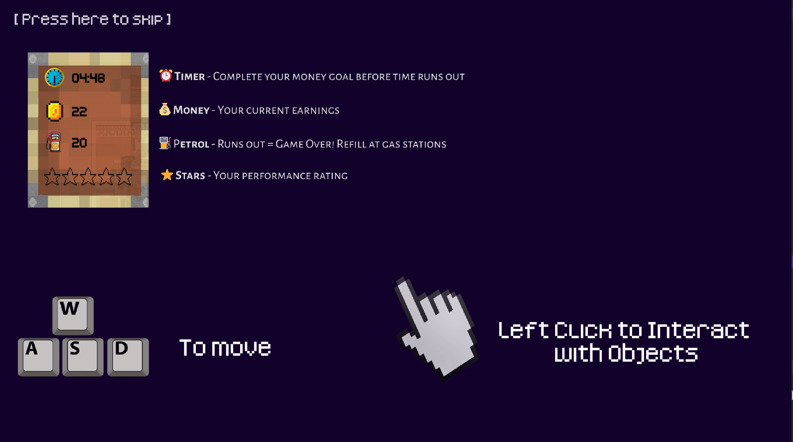
  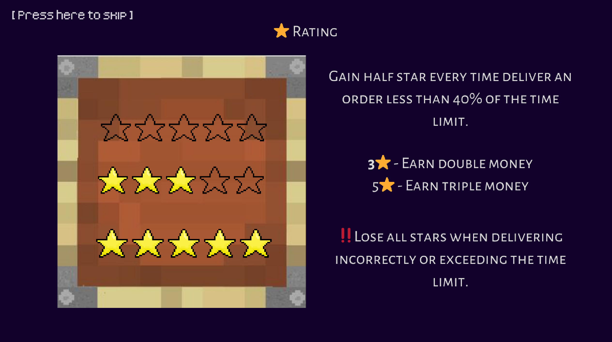
  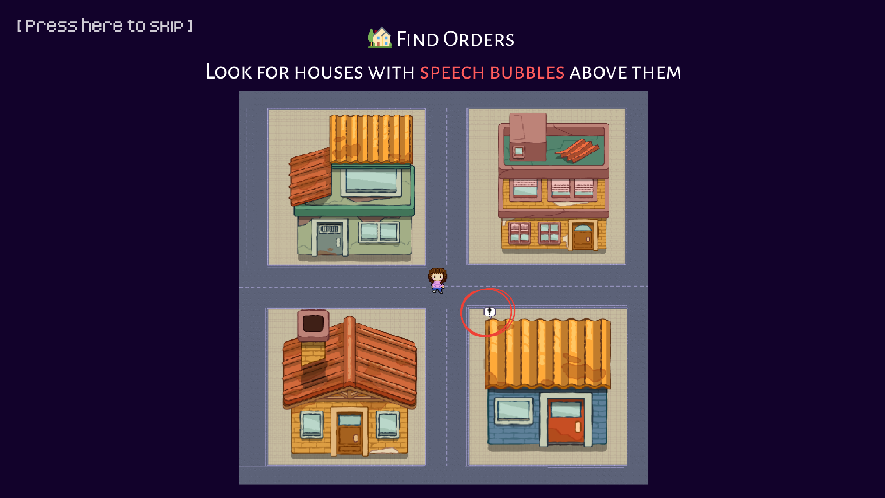

  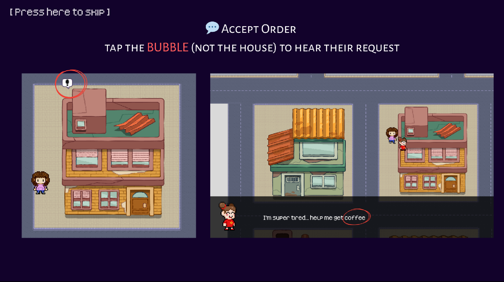
  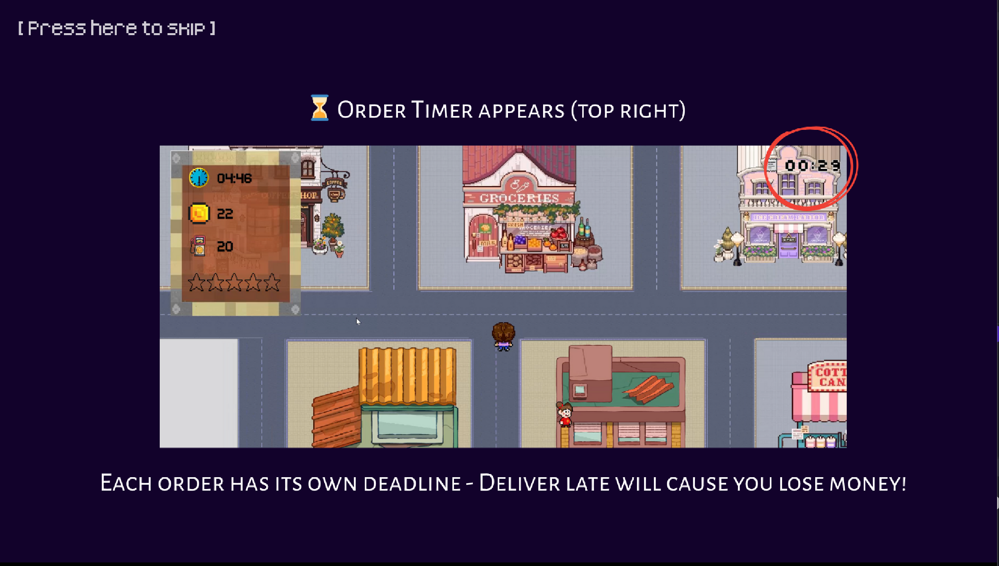
  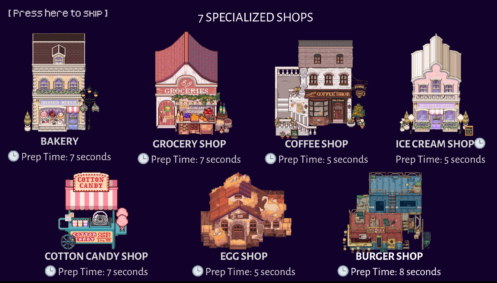

  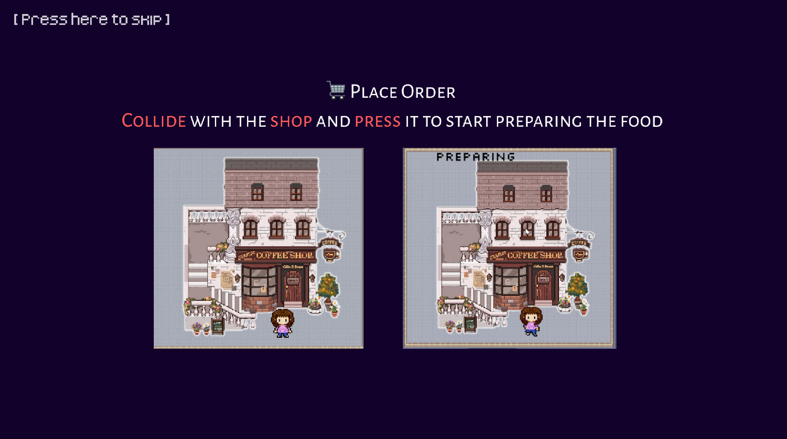
  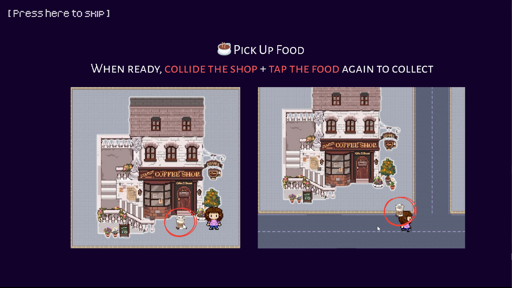
  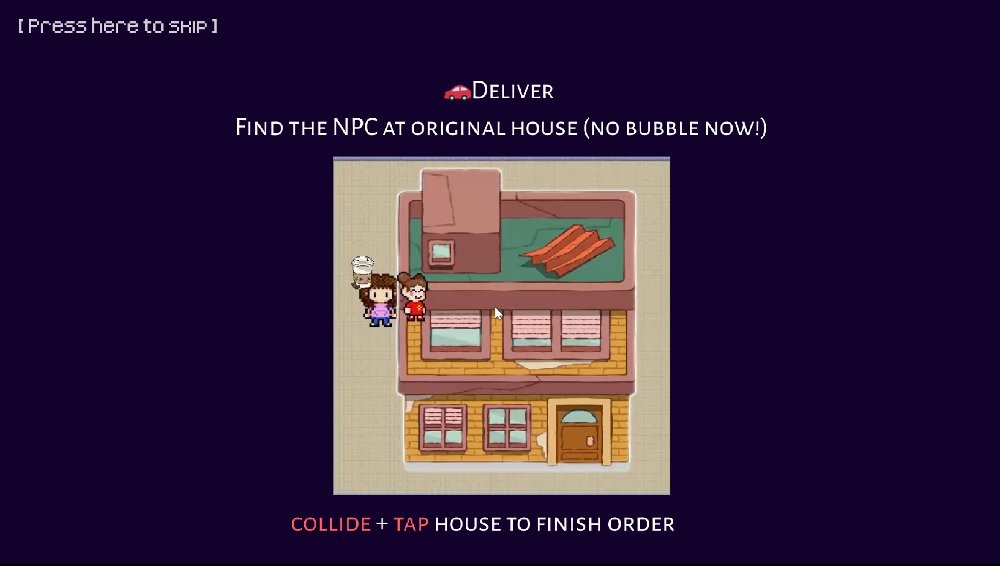

  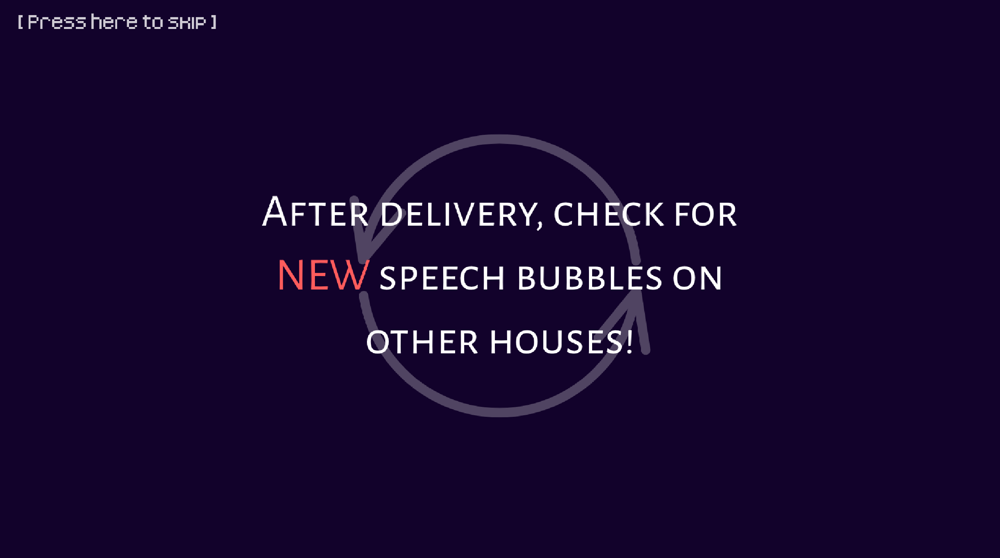
  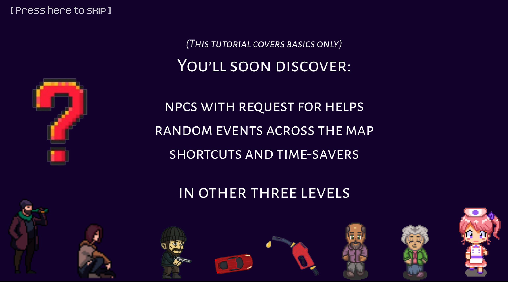

## 🧩 Levels Screenshots

### 🔹 Level 1: Rental

  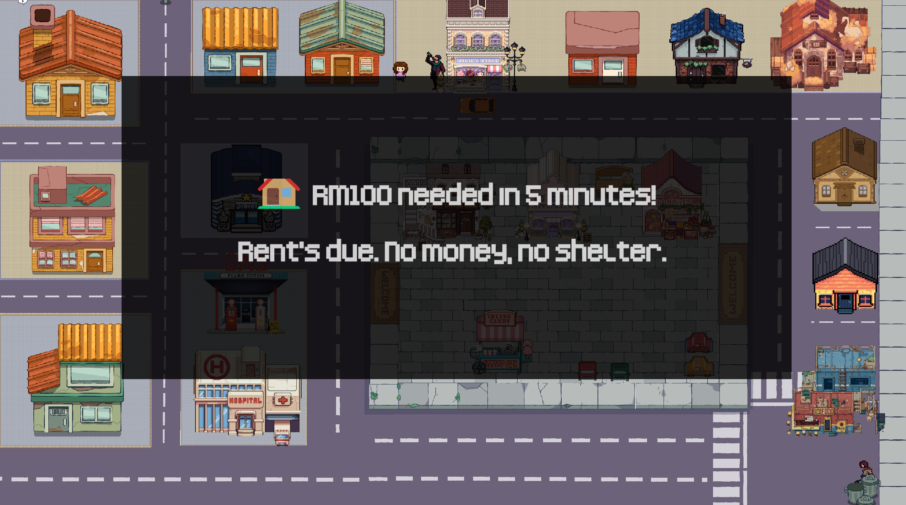
  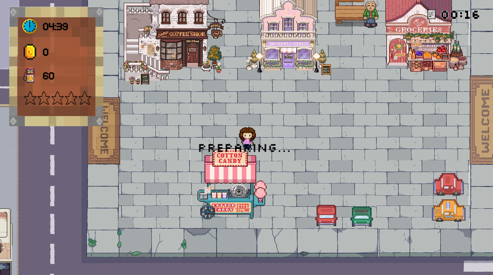

---

### 🔹 Level 2: Emergency Expenses

  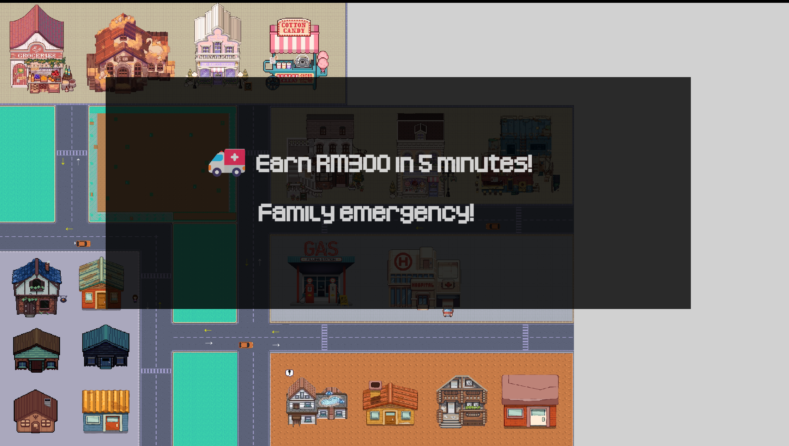
  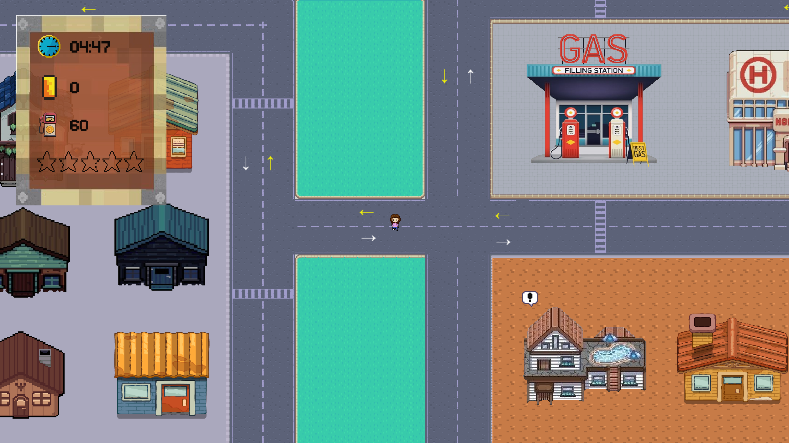

---

### 🔹 Level 3: Semester Fees

  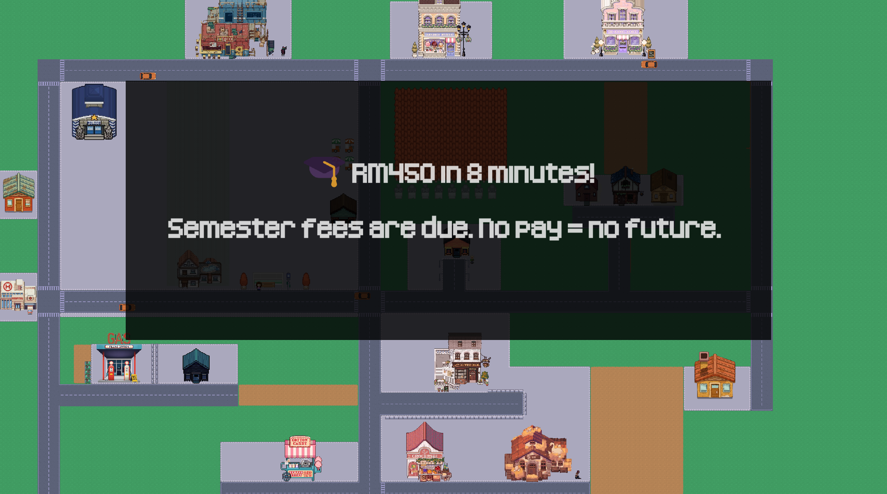
  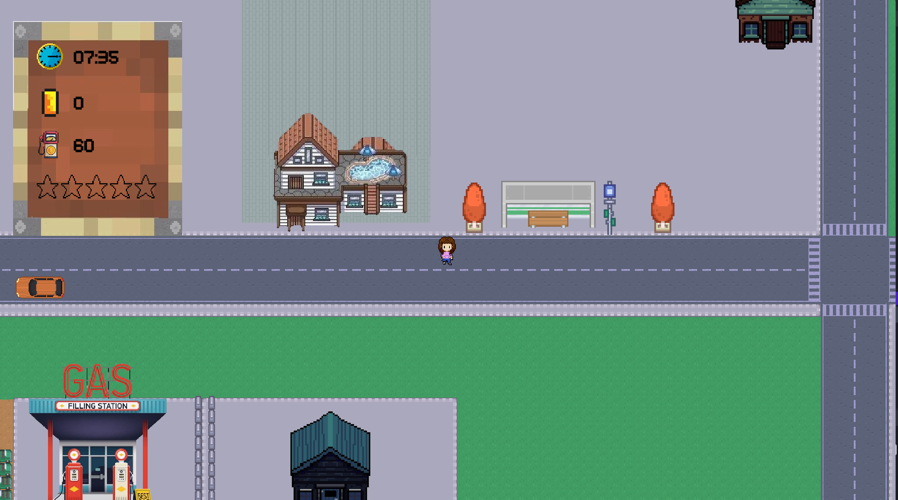

## 👥 Team Members & Contributions

- [@aiyayayah](https://github.com/aiyayayah)  
  → Level 1 Designer   
  → In charge of tutorial scene, camera movement, UI setup, sound effects, and supporting event logic

- [@Sherry7920](https://github.com/Sherry7920)  
  → Level 2 Designer  
  → Responsible for level coordination, win/lose condition logic, UI elements, and event integration

- [@ccp0526](https://github.com/ccp0526)  
  → Level 3 Designer  
  → Developed the core delivery logic, including order acceptance, delivery correctness checks, rating system and related mechanics

**Special Thanks To**:  
  MMU lecturers and classmates for their valuable feedback and testing support.
